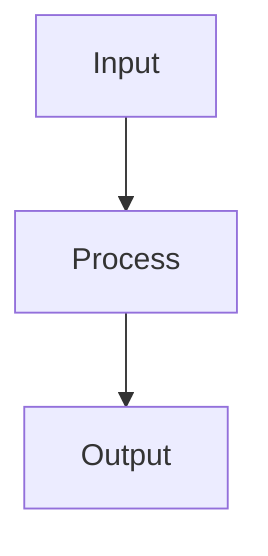

# Mermaid Diagram Skill

Create professional diagrams using Mermaid syntax for GitHub README and documentation.

## Usage
```
/mermaid flowchart    # Create a flowchart
/mermaid architecture # Create an architecture diagram
/mermaid timeline     # Create a timeline
/mermaid comparison   # Create a comparison diagram
```

## Supported Diagram Types for GitHub

GitHub renders Mermaid natively in markdown using fenced code blocks:

````markdown

````

### Available Types
- `graph TD/LR` — Flowcharts (top-down or left-right)
- `sequenceDiagram` — Sequence diagrams
- `classDiagram` — Class/structure diagrams
- `flowchart` — Advanced flowcharts with subgraphs
- `gantt` — Gantt charts / timelines
- `pie` — Pie charts
- `xychart-beta` — Bar/line charts
- `block-beta` — Block diagrams

### Style Tips
- Use emojis in node labels for visual appeal
- Use `:::className` for custom styling
- Use subgraphs to group related nodes
- Keep diagrams focused — one concept per diagram
- Use `style` commands for color coding
