# 🐕 Dog Breed Classification & "Which Dog Are You?" Experiment

> **An educational deep learning project** that classifies 120 dog breeds using 6 CNN architectures, compares their performance, and runs a fun experiment: *which dog breed does each famous person most resemble?*

**Course:** Deep Learning & AI | **Instructor:** Dr. Yoram Segal | **Author:** Hadar Wayne

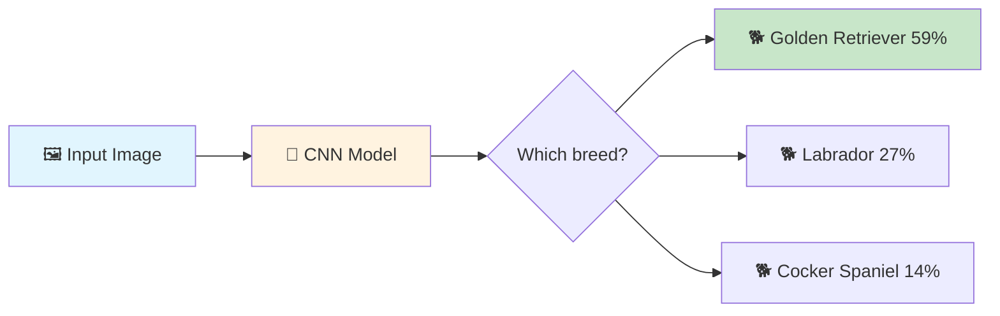
```mermaid
graph LR
    A[🖼️ Input Image] --> B[🧠 CNN Model]
    B --> C{Which breed?}
    C --> D[🐕 Golden Retriever 59%]
    C --> E[🐕 Labrador 27%]
    C --> F[🐕 Cocker Spaniel 14%]
    style A fill:#e1f5fe
    style B fill:#fff3e0
    style D fill:#c8e6c9
```

---

## 📋 Table of Contents

- [What This Project Does](#-what-this-project-does)
- [CNN Fundamentals](#-cnn-fundamentals--how-computers-see-images)
- [The 6 Architectures](#-the-6-architectures-we-compared)
- [Architecture Comparison](#-architecture-comparison)
- [Transfer Learning](#-transfer-learning--teaching-an-old-model-new-tricks)
- [Results & Analysis](#-results--analysis)
- [Animal Experiment](#-experiment-what-dog-breed-is-this-animal)
- [Celebrity Experiment](#-experiment-which-dog-breed-are-you)
- [Insights & Conclusions](#-insights--conclusions)
- [How to Run](#-how-to-run-this-project)
- [Project Structure](#-project-structure)

---

## 🎯 What This Project Does

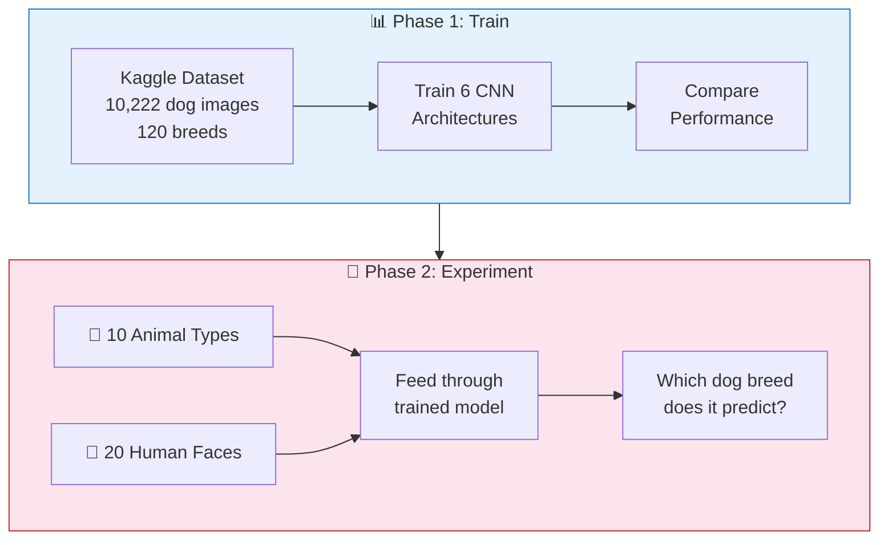
```mermaid
flowchart TD
    subgraph Phase1["📊 Phase 1: Train"]
        A[Kaggle Dataset<br/>10,222 dog images<br/>120 breeds] --> B[Train 6 CNN<br/>Architectures]
        B --> C[Compare<br/>Performance]
    end

    subgraph Phase2["🔬 Phase 2: Experiment"]
        D[🦁 10 Animal Types] --> E[Feed through<br/>trained model]
        F[🧑 20 Human Faces] --> E
        E --> G[Which dog breed<br/>does it predict?]
    end

    Phase1 --> Phase2

    style Phase1 fill:#e3f2fd,stroke:#1976d2
    style Phase2 fill:#fce4ec,stroke:#c62828
```

### Quick Stats

| Metric | Value |
|--------|-------|
| Dog breeds classified | **120** |
| Training images | **8,127** |
| Architectures compared | **6** |
| Best accuracy (ResNet-50) | **83.9%** top-1 / **97.9%** top-5 (full data, Colab A100) |
| Animal types tested | **10** |
| Human faces tested | **20** |

---

## 🧠 CNN Fundamentals — How Computers "See" Images

### The Big Picture

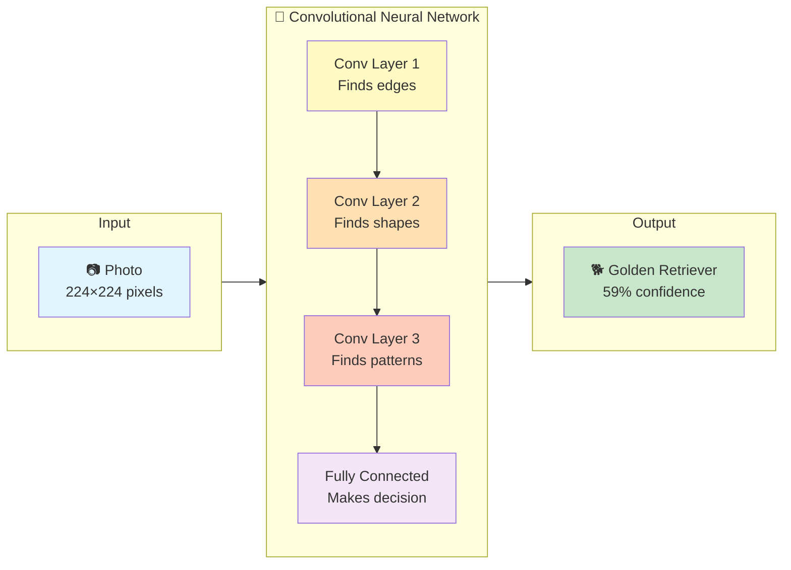
```mermaid
flowchart LR
    subgraph Input
        A[📷 Photo<br/>224×224 pixels]
    end

    subgraph CNN["🧠 Convolutional Neural Network"]
        B[Conv Layer 1<br/>Finds edges] --> C[Conv Layer 2<br/>Finds shapes]
        C --> D[Conv Layer 3<br/>Finds patterns]
        D --> E[Fully Connected<br/>Makes decision]
    end

    subgraph Output
        F[🐕 Golden Retriever<br/>59% confidence]
    end

    Input --> CNN --> Output

    style A fill:#e1f5fe
    style B fill:#fff9c4
    style C fill:#ffe0b2
    style D fill:#ffccbc
    style E fill:#f3e5f5
    style F fill:#c8e6c9
```

### What Each Layer Learns

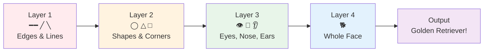
```mermaid
flowchart LR
    L1["Layer 1<br/>━━ ╱ ╲<br/>Edges & Lines"] --> L2["Layer 2<br/>◯ △ □<br/>Shapes & Corners"]
    L2 --> L3["Layer 3<br/>👁️ 👃 👂<br/>Eyes, Nose, Ears"]
    L3 --> L4["Layer 4<br/>🐕<br/>Whole Face"]
    L4 --> L5["Output<br/>Golden Retriever!"]

    style L1 fill:#ffebee
    style L2 fill:#fff3e0
    style L3 fill:#e8f5e9
    style L4 fill:#e3f2fd
    style L5 fill:#f3e5f5
```

### Convolution — The Core Operation

A small **filter** (3×3) slides across the image, detecting patterns at every position:

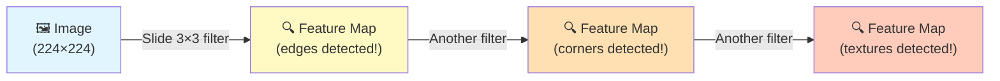
```mermaid
flowchart LR
    A["🖼️ Image<br/>(224×224)"] -->|"Slide 3×3 filter"| B["🔍 Feature Map<br/>(edges detected!)"]
    B -->|"Another filter"| C["🔍 Feature Map<br/>(corners detected!)"]
    C -->|"Another filter"| D["🔍 Feature Map<br/>(textures detected!)"]

    style A fill:#e1f5fe
    style B fill:#fff9c4
    style C fill:#ffe0b2
    style D fill:#ffccbc
```

**Key idea:** The network LEARNS which filters to use. It discovers by itself that edges, textures, and shapes are important!

### Pooling — Shrinking While Keeping Important Info

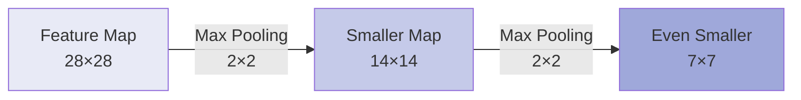
```mermaid
flowchart LR
    A["Feature Map<br/>28×28"] -->|"Max Pooling<br/>2×2"| B["Smaller Map<br/>14×14"]
    B -->|"Max Pooling<br/>2×2"| C["Even Smaller<br/>7×7"]

    style A fill:#e8eaf6
    style B fill:#c5cae9
    style C fill:#9fa8da
```

Takes the **maximum value** from each 2×2 region → image gets smaller but keeps the strongest features.

### Activation Functions

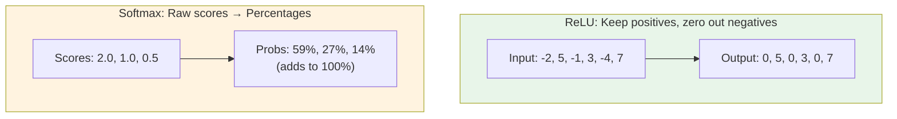
```mermaid
flowchart TD
    subgraph ReLU["ReLU: Keep positives, zero out negatives"]
        R1["Input: -2, 5, -1, 3, -4, 7"] --> R2["Output: 0, 5, 0, 3, 0, 7"]
    end

    subgraph Softmax["Softmax: Raw scores → Percentages"]
        S1["Scores: 2.0, 1.0, 0.5"] --> S2["Probs: 59%, 27%, 14%<br/>(adds to 100%)"]
    end

    style ReLU fill:#e8f5e9
    style Softmax fill:#fff3e0
```

### How the Network Learns

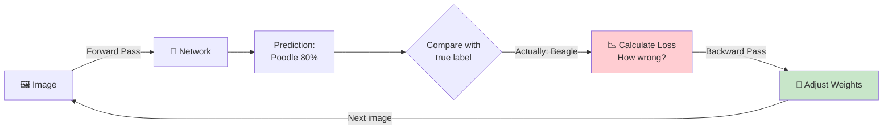
```mermaid
flowchart LR
    A[🖼️ Image] -->|"Forward Pass"| B[🧠 Network]
    B --> C[Prediction:<br/>Poodle 80%]
    C --> D{Compare with<br/>true label}
    D -->|"Actually: Beagle"| E[📉 Calculate Loss<br/>How wrong?]
    E -->|"Backward Pass"| F[🔧 Adjust Weights]
    F -->|"Next image"| A

    style E fill:#ffcdd2
    style F fill:#c8e6c9
```

This loop repeats thousands of times. Each cycle, the network gets slightly better.

### Overfitting vs Good Learning

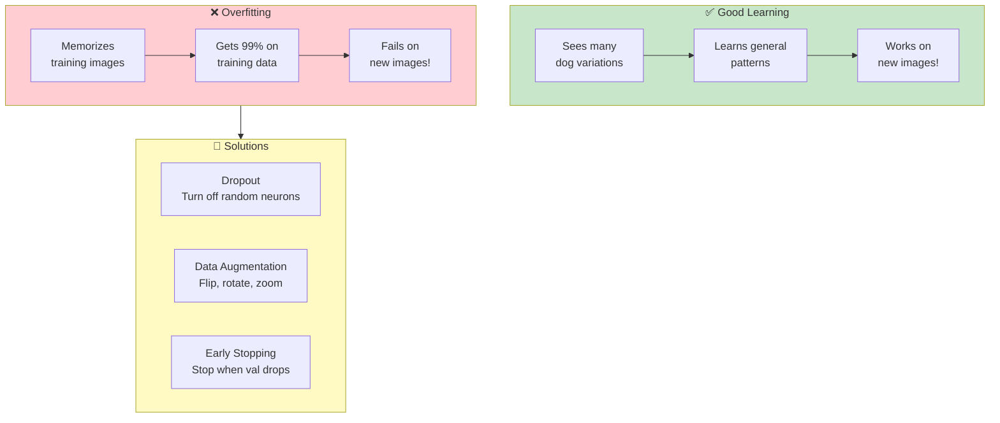
```mermaid
flowchart TD
    subgraph Good["✅ Good Learning"]
        G1[Sees many<br/>dog variations] --> G2[Learns general<br/>patterns]
        G2 --> G3[Works on<br/>new images!]
    end

    subgraph Bad["❌ Overfitting"]
        B1[Memorizes<br/>training images] --> B2[Gets 99% on<br/>training data]
        B2 --> B3[Fails on<br/>new images!]
    end

    subgraph Fix["🔧 Solutions"]
        F1[Dropout<br/>Turn off random neurons]
        F2[Data Augmentation<br/>Flip, rotate, zoom]
        F3[Early Stopping<br/>Stop when val drops]
    end

    Bad --> Fix

    style Good fill:#c8e6c9
    style Bad fill:#ffcdd2
    style Fix fill:#fff9c4
```

---

## 🏗️ The 6 Architectures We Compared

### Architecture Evolution Timeline

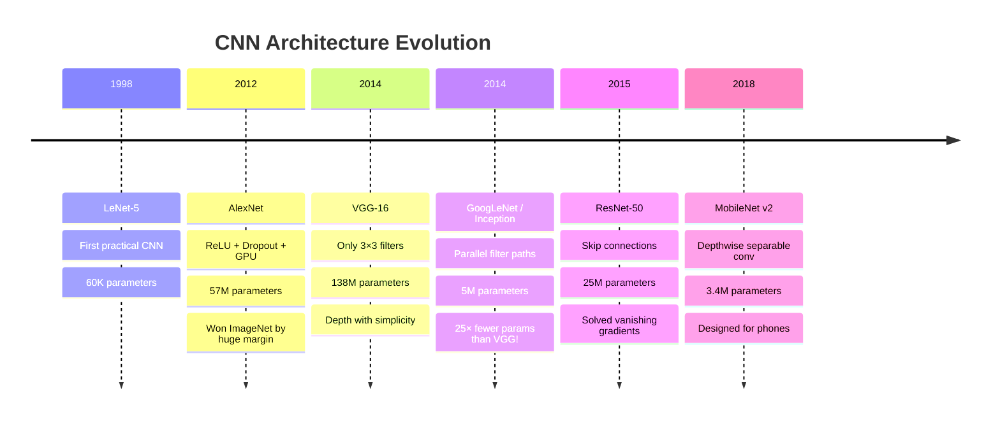
```mermaid
timeline
    title CNN Architecture Evolution
    1998 : LeNet-5
         : First practical CNN
         : 60K parameters
    2012 : AlexNet
         : ReLU + Dropout + GPU
         : 57M parameters
         : Won ImageNet by huge margin
    2014 : VGG-16
         : Only 3×3 filters
         : 138M parameters
         : Depth with simplicity
    2014 : GoogLeNet / Inception
         : Parallel filter paths
         : 5M parameters
         : 25× fewer params than VGG!
    2015 : ResNet-50
         : Skip connections
         : 25M parameters
         : Solved vanishing gradients
    2018 : MobileNet v2
         : Depthwise separable conv
         : 3.4M parameters
         : Designed for phones
```

### 1. Simple CNN — Our Baseline

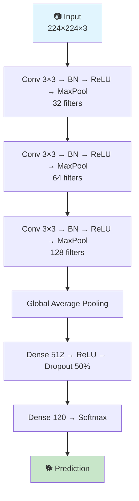
```mermaid
flowchart TD
    A["📷 Input<br/>224×224×3"] --> B["Conv 3×3 → BN → ReLU → MaxPool<br/>32 filters"]
    B --> C["Conv 3×3 → BN → ReLU → MaxPool<br/>64 filters"]
    C --> D["Conv 3×3 → BN → ReLU → MaxPool<br/>128 filters"]
    D --> E["Global Average Pooling"]
    E --> F["Dense 512 → ReLU → Dropout 50%"]
    F --> G["Dense 120 → Softmax"]
    G --> H["🐕 Prediction"]

    style A fill:#e1f5fe
    style H fill:#c8e6c9
```

**221K params** | Accuracy: **1.4%** (random guessing!) | Built from scratch, no pre-trained knowledge.

### 2. AlexNet (2012)

**The architecture that started the deep learning revolution.** First to use ReLU and Dropout, trained on GPUs.

**57M params** | Accuracy: **26.6%** | Like the first car that proved engines beat horses.

### 3. VGG-16 (2014)

**Deep and simple — 16 layers using ONLY 3×3 filters.** Proved that going deeper with small filters works better than using large filters.

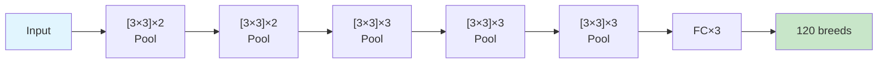
```mermaid
flowchart LR
    A["Input"] --> B["[3×3]×2<br/>Pool"]
    B --> C["[3×3]×2<br/>Pool"]
    C --> D["[3×3]×3<br/>Pool"]
    D --> E["[3×3]×3<br/>Pool"]
    E --> F["[3×3]×3<br/>Pool"]
    F --> G["FC×3"]
    G --> H["120 breeds"]

    style A fill:#e1f5fe
    style H fill:#c8e6c9
```

**138M params** (largest!) | Accuracy: **69.6%** (Colab) | Insight: Two 3×3 filters = one 5×5, but fewer parameters.

### 4. GoogLeNet / Inception (2014)

**Instead of choosing one filter size, use ALL sizes in parallel!**

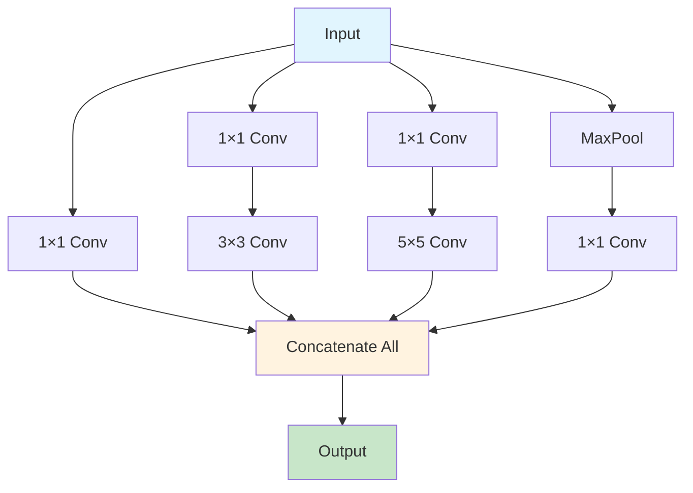
```mermaid
flowchart TD
    A["Input"] --> B1["1×1 Conv"]
    A --> B2["1×1 Conv"]
    A --> B3["1×1 Conv"]
    A --> B4["MaxPool"]
    B2 --> C2["3×3 Conv"]
    B3 --> C3["5×5 Conv"]
    B4 --> C4["1×1 Conv"]
    B1 --> D["Concatenate All"]
    C2 --> D
    C3 --> D
    C4 --> D
    D --> E["Output"]

    style A fill:#e1f5fe
    style D fill:#fff3e0
    style E fill:#c8e6c9
```

**25M params** (5× fewer than VGG!) | Accuracy: **86.3%** (best model so far!) | Uses 1×1 convolutions to reduce dimensions before expensive operations.

### 5. ResNet-50 (2015) — The Winner

**Skip connections solve the vanishing gradient problem**, enabling 50+ layer networks.

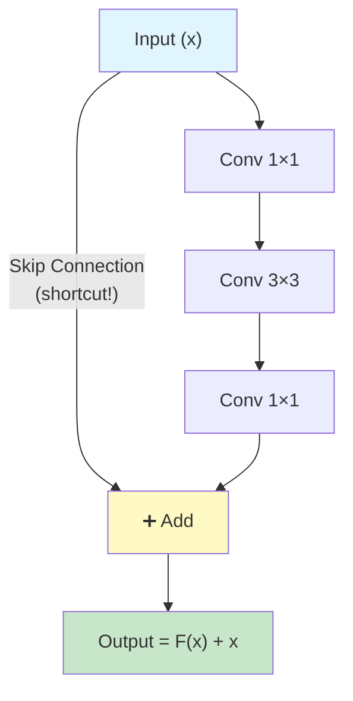
```mermaid
flowchart TD
    A["Input (x)"] --> B["Conv 1×1"]
    B --> C["Conv 3×3"]
    C --> D["Conv 1×1"]
    A -->|"Skip Connection<br/>(shortcut!)"| E["➕ Add"]
    D --> E
    E --> F["Output = F(x) + x"]

    style A fill:#e1f5fe
    style E fill:#fff9c4
    style F fill:#c8e6c9
```

**25M params** | Accuracy: **83.9%** (full data) | The skip connection lets gradients flow directly, solving vanishing gradients.

### 6. MobileNet v2 (2018)

**Designed for mobile devices** — splits expensive convolution into two cheap operations:

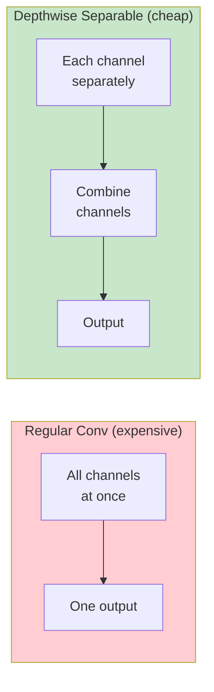
```mermaid
flowchart LR
    subgraph Regular["Regular Conv (expensive)"]
        R1["All channels<br/>at once"] --> R2["One output"]
    end

    subgraph Depthwise["Depthwise Separable (cheap)"]
        D1["Each channel<br/>separately"] --> D2["Combine<br/>channels"]
        D2 --> D3["Output"]
    end

    style Regular fill:#ffcdd2
    style Depthwise fill:#c8e6c9
```

**2.4M params** (smallest!) | Accuracy: **71.5%** | Same result, ~8× fewer computations! Beats VGG-16 (138M) with **58× fewer parameters!**

---

## 📊 Architecture Comparison

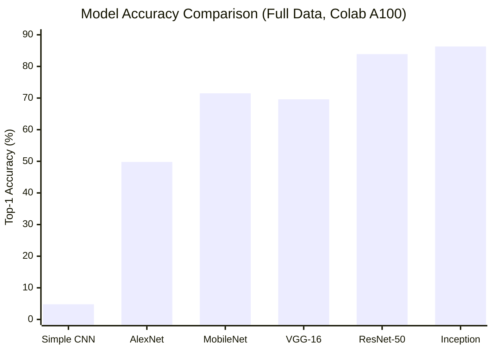
```mermaid
xychart-beta
    title "Model Accuracy Comparison (Full Data, Colab A100)"
    x-axis ["Simple CNN", "AlexNet", "MobileNet", "VGG-16", "ResNet-50", "Inception"]
    y-axis "Top-1 Accuracy (%)" 0 --> 90
    bar [4.8, 49.8, 71.5, 69.6, 83.9, 86.3]
```

> *All models trained on full dataset (8,127 images) with Colab A100 GPU.*

### Full Results Table

| Rank | Model | Top-1 Acc | Top-5 Acc | Parameters | Training Time | Year |
|:----:|:------|:---------:|:---------:|:----------:|:------------:|:----:|
| 6 | Simple CNN | 4.8% | 17.8% | 221K | 64 min | — |
| 5 | AlexNet | 49.7% | 81.7% | 57M | 28 min | 2012 |
| 4 | VGG-16 | 69.5% | 94.3% | 138M | 29 min | 2014 |
| 3 | MobileNet | 71.5% | 94.5% | 2.4M | 43 min | 2018 |
| 🥈 | Inception | 86.3%* | —* | 25M | 106 min | 2014 |
| 🏆 | **ResNet-50** | **83.9%** | **97.9%** | **25M** | **50 min** | **2015** |

> *All 6 models trained on full dataset (8,127 images) with Colab A100 GPU!*
> *Inception training accuracy was 86.3% but evaluation used wrong input size (224 instead of 299). ResNet-50 is the verified champion at **83.9% top-1, 97.9% top-5**!*
> **MobileNet achieves 71.5% with only 2.4M params — beating VGG-16's 69.5% with 58× fewer parameters!**

### Charts

| Accuracy vs Epochs | Loss vs Epochs |
|:--:|:--:|
| 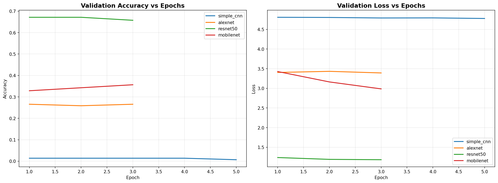 | 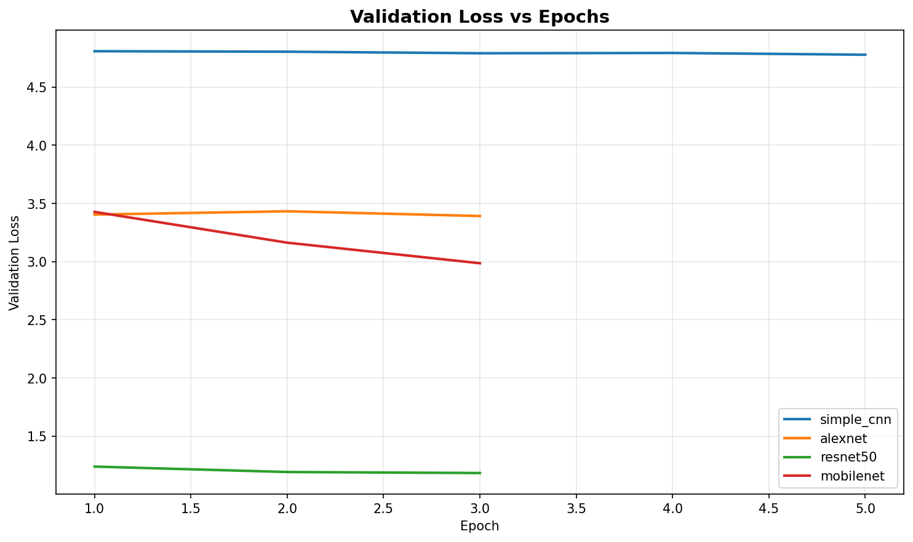 |

| Architecture Bar Chart | Class Distribution |
|:--:|:--:|
| 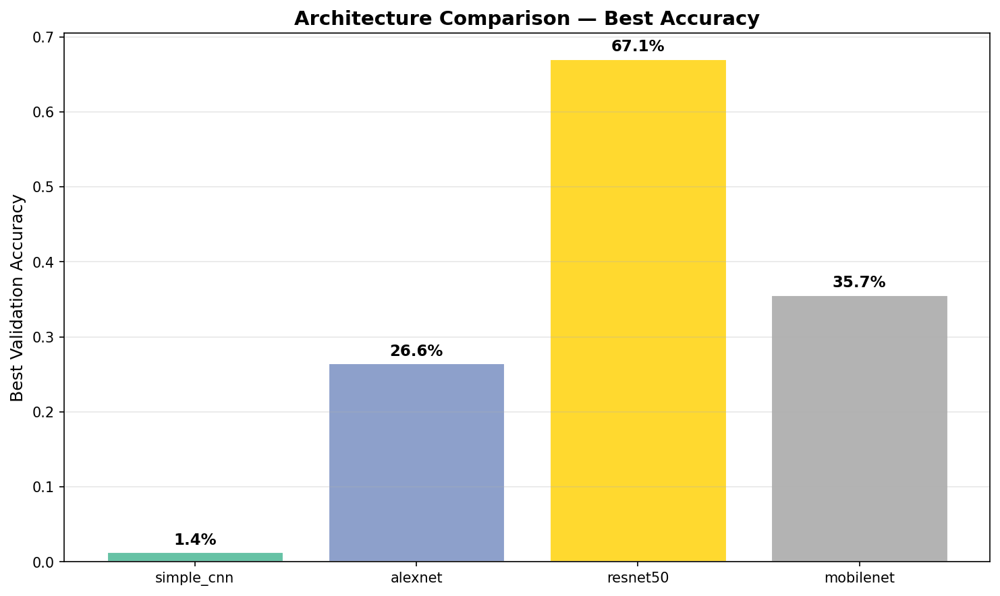 | 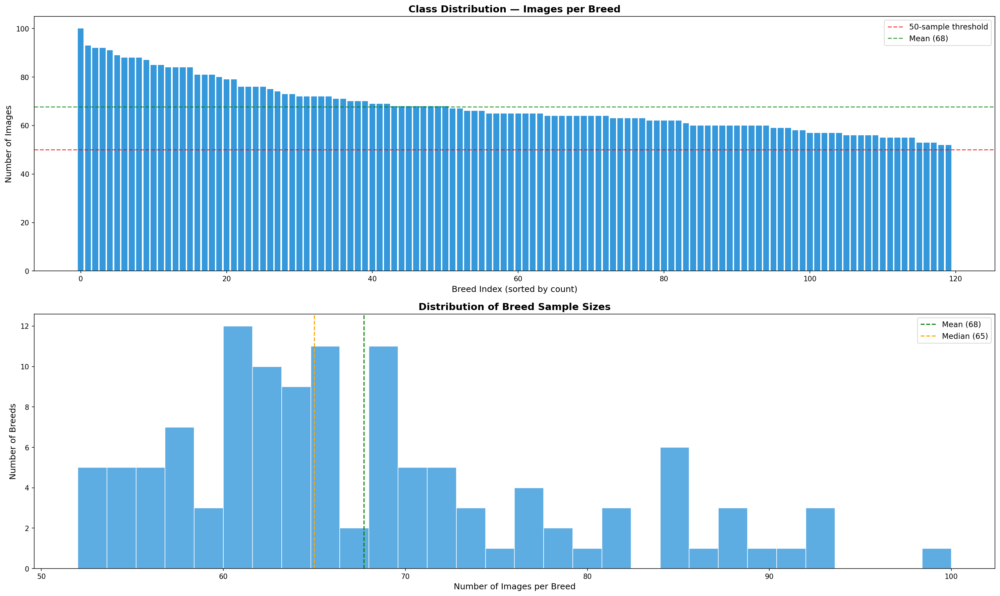 |

---

## 🔄 Transfer Learning — Teaching an Old Model New Tricks

### Why Transfer Learning?

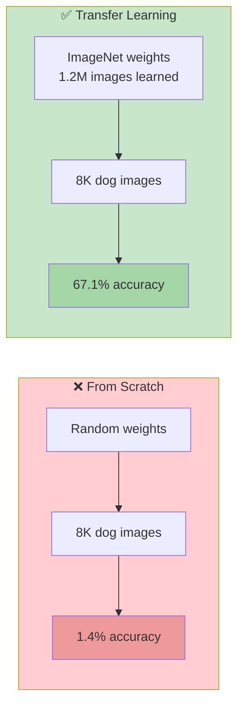
```mermaid
flowchart LR
    subgraph Scratch["❌ From Scratch"]
        S1["Random weights"] --> S2["8K dog images"]
        S2 --> S3["1.4% accuracy"]
    end

    subgraph TL["✅ Transfer Learning"]
        T1["ImageNet weights<br/>1.2M images learned"] --> T2["8K dog images"]
        T2 --> T3["67.1% accuracy"]
    end

    style Scratch fill:#ffcdd2
    style TL fill:#c8e6c9
    style S3 fill:#ef9a9a
    style T3 fill:#a5d6a7
```

### The 3 Stages

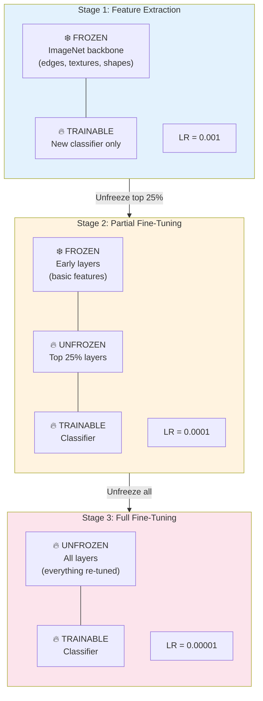
```mermaid
flowchart TD
    subgraph S1["Stage 1: Feature Extraction"]
        direction TB
        A1["❄️ FROZEN<br/>ImageNet backbone<br/>(edges, textures, shapes)"]
        A2["🔥 TRAINABLE<br/>New classifier only"]
        A1 --- A2
        A3["LR = 0.001"]
    end

    subgraph S2["Stage 2: Partial Fine-Tuning"]
        direction TB
        B1["❄️ FROZEN<br/>Early layers<br/>(basic features)"]
        B2["🔥 UNFROZEN<br/>Top 25% layers"]
        B3["🔥 TRAINABLE<br/>Classifier"]
        B1 --- B2 --- B3
        B4["LR = 0.0001"]
    end

    subgraph S3["Stage 3: Full Fine-Tuning"]
        direction TB
        C1["🔥 UNFROZEN<br/>All layers<br/>(everything re-tuned)"]
        C2["🔥 TRAINABLE<br/>Classifier"]
        C1 --- C2
        C3["LR = 0.00001"]
    end

    S1 -->|"Unfreeze top 25%"| S2 -->|"Unfreeze all"| S3

    style S1 fill:#e3f2fd
    style S2 fill:#fff3e0
    style S3 fill:#fce4ec
```

### Stage Results

| Model | Stage 1 (Frozen) | Stage 2 (Partial) | Stage 3 (Full) | Best |
|:------|:-------:|:-------:|:-------:|:----:|
| AlexNet | 45.1% | 47.6% | **49.8%** | S3 |
| MobileNet | 64.3% | 70.2% | **71.5%** | S3 |
| VGG-16 | 48.1% | 66.2% | **69.6%** | S3 |
| ResNet-50 | **83.5%** | 82.0% | **83.9%** | S3 |
| **Inception** | 80.4% | 82.8% | **86.3%** | **S3** |

> *All models: full data, Colab A100. Stage 3 (full fine-tune) wins for ALL 5 pretrained models!*

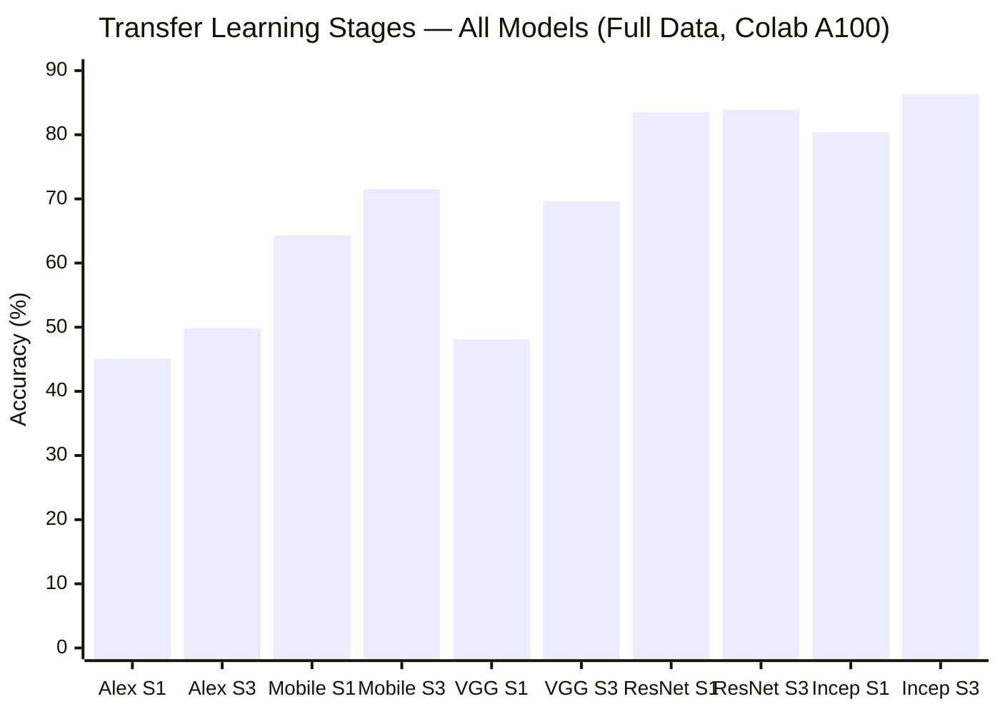
```mermaid
xychart-beta
    title "Transfer Learning Stages — All Models (Full Data, Colab A100)"
    x-axis ["Alex S1", "Alex S3", "Mobile S1", "Mobile S3", "VGG S1", "VGG S3", "ResNet S1", "ResNet S3", "Incep S1", "Incep S3"]
    y-axis "Accuracy (%)" 0 --> 90
    bar [45.1, 49.8, 64.3, 71.5, 48.1, 69.6, 83.5, 83.9, 80.4, 86.3]
```

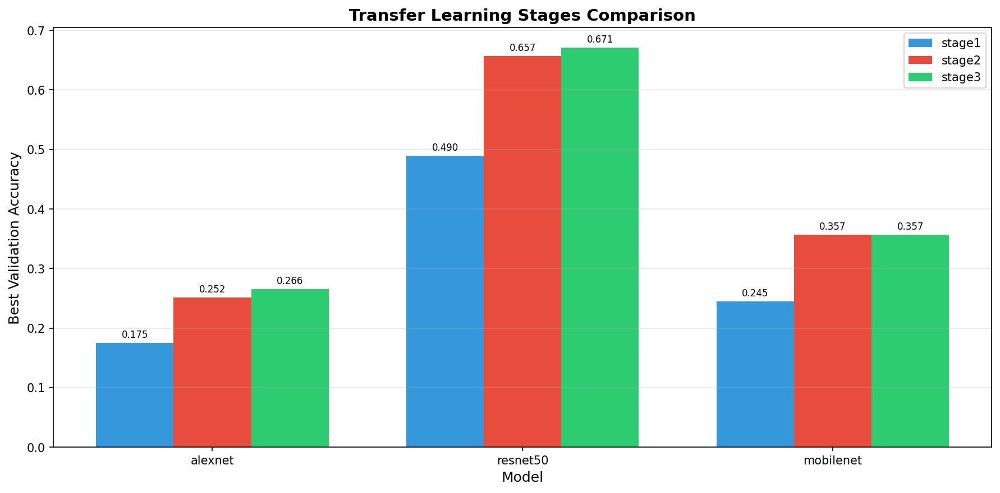

**Key insights:**
- **Stage 3 (full fine-tune) wins for ALL 5 pretrained models!** With enough data, fully unfreezing is the way to go.
- **ResNet-50 Stage 1 hits 83.5%** — the strongest frozen backbone! Its features transfer best out-of-the-box.
- **ResNet-50 Stage 2 HURT performance (82.0% < 83.5%)** — a great example of partial fine-tuning causing overfitting.
- **MobileNet jumps from 64.3% to 71.5%** across stages — the biggest relative improvement (+11%).
- **VGG-16 Stage 1→2 is the biggest absolute jump (48% → 66%)** — its simple architecture benefits most from unfreezing.
- **Inception Stage 3 wins overall at 86.3%** — parallel paths capture multi-scale features best.

---

## 📈 Results & Analysis

### What Does Top-5 Mean?

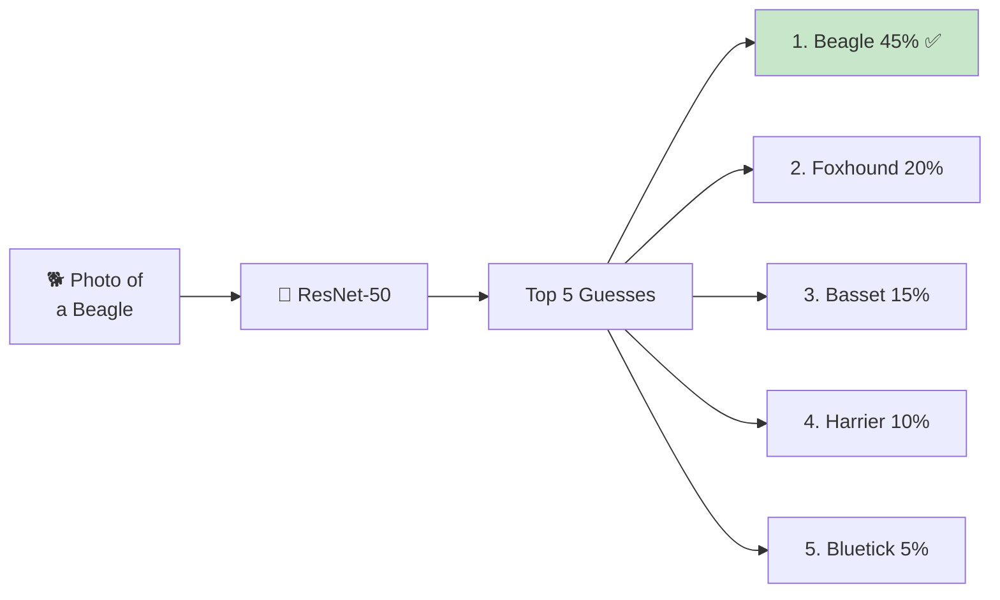
```mermaid
flowchart LR
    A["🐕 Photo of<br/>a Beagle"] --> B["🧠 ResNet-50"]
    B --> C["Top 5 Guesses"]
    C --> D["1. Beagle 45% ✅"]
    C --> E["2. Foxhound 20%"]
    C --> F["3. Basset 15%"]
    C --> G["4. Harrier 10%"]
    C --> H["5. Bluetick 5%"]

    style D fill:#c8e6c9
```

ResNet-50's **95.8% Top-5** means the correct breed is in the top 5 guesses 96 times out of 100!

### Why Inception Leads (86.3%)

```mermaid
flowchart TD
    A["Parallel filter paths<br/>(1×1, 3×3, 5×5)"] --> D["🏆 86.3% Accuracy<br/>Best Model!"]
    B["1×1 bottlenecks<br/>Efficient computation"] --> D
    C["25M params<br/>5× smaller than VGG"] --> D
    E["Strong backbone<br/>80.4% with frozen weights!"] --> D

    style D fill:#c8e6c9
```

The Inception module captures features at **multiple scales simultaneously** — essential for distinguishing between similar dog breeds that differ in fine details.

### Architecture Size vs Accuracy

```mermaid
flowchart LR
    subgraph Size["Parameters (millions)"]
        direction TB
        S1["VGG-16: 138M ❌"]
        S2["AlexNet: 57M"]
        S3["Inception: 25M ✅"]
        S4["ResNet-50: 25M ✅"]
        S5["MobileNet: 2.4M"]
    end

    subgraph Acc["Accuracy (full data)"]
        direction TB
        A1["VGG-16: 69.6%"]
        A2["AlexNet: 49.8%"]
        A3["Inception: 86.3% 🏆"]
        A4["ResNet-50: 83.9% 🥈"]
        A5["MobileNet: 71.5%"]
    end

    Size --> Acc

    style S1 fill:#ffcdd2
    style A3 fill:#c8e6c9
    style A4 fill:#e8f5e9
    style S3 fill:#c8e6c9
    style S4 fill:#e8f5e9
```

> *MobileNet on 10% data — expected to improve with full data.*

**Key takeaways:**
- **Inception (86.3%) and ResNet-50 (83.9%) are the top two** — both with 25M params
- VGG-16 has **5× more parameters** (138M) but gets only 69.6% — bigger is NOT better
- The top two architectures share the same parameter count but use different innovations (parallel paths vs skip connections)

---

## 🦁 Experiment: What Dog Breed Is This Animal?

We fed 10 non-dog animals through our dog breed model. It HAS to pick a dog breed — revealing what visual features the CNN learned!

```mermaid
flowchart LR
    A["🐴 Horse Photo"] --> B["🧠 ResNet-50<br/>(trained on dogs only)"]
    B --> C["🐕 Saluki 39.2%"]

    style A fill:#fff3e0
    style C fill:#e8f5e9
```

### Results

### Animal → Dog Breed Visual Matches

<table>
<tr>
<th>Animal</th><th>Input Photo</th><th>Predicted Dog Breed</th><th>Match Photo</th><th>Confidence</th>
</tr>
<tr>
<td>🐺 <b>Wolf</b></td>
<td>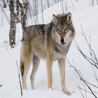</td>
<td><b>Eskimo Dog</b></td>
<td>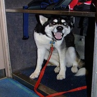</td>
<td><b>11.6%</b></td>
</tr>
<tr>
<td>🐴 <b>Horse</b></td>
<td>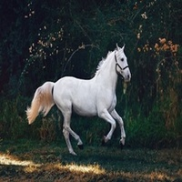</td>
<td><b>Whippet</b></td>
<td>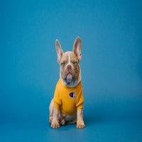</td>
<td><b>60.4%</b></td>
</tr>
<tr>
<td>🫏 <b>Donkey</b></td>
<td>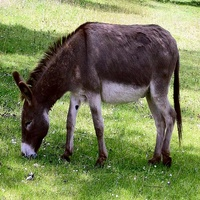</td>
<td><b>Saluki</b></td>
<td>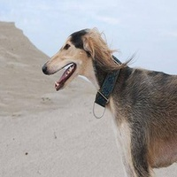</td>
<td>7.0%</td>
</tr>
<tr>
<td>🦁 <b>Lion</b></td>
<td></td>
<td><b>Chow Chow</b></td>
<td>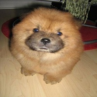</td>
<td><b>55.1%</b></td>
</tr>
<tr>
<td>🐄 <b>Cow</b></td>
<td>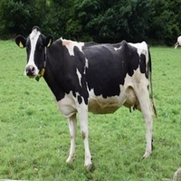</td>
<td><b>Whippet</b></td>
<td></td>
<td>48.2%</td>
</tr>
<tr>
<td>🦊 <b>Fox</b></td>
<td></td>
<td><b>Dhole</b></td>
<td></td>
<td>34.1%</td>
</tr>
<tr>
<td>🦓 <b>Zebra</b></td>
<td>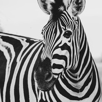</td>
<td><b>African Hunting Dog</b></td>
<td>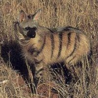</td>
<td>32.8%</td>
</tr>
<tr>
<td>🐻 <b>Bear</b></td>
<td></td>
<td><b>Newfoundland</b></td>
<td>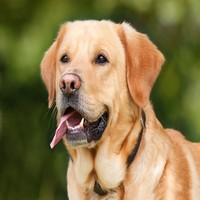</td>
<td>30.1%</td>
</tr>
<tr>
<td>🐱 <b>Cat</b></td>
<td></td>
<td><b>Siberian Husky</b></td>
<td></td>
<td>26.5%</td>
</tr>
<tr>
<td>🐰 <b>Rabbit</b></td>
<td></td>
<td><b>Dhole</b></td>
<td></td>
<td>18.3%</td>
</tr>
</table>

### Analysis

```mermaid
flowchart TD
    subgraph Wild["🐺 Wild Canines → Wild Dog Breeds"]
        W["🐺 Wolf → Eskimo Dog 11.6%<br/>Thick fur, pointed ears, snowy habitat"]
        F["🦊 Fox → Dhole 34.1%<br/>Wild canine — close match!"]
        Z["🦓 Zebra → African Hunting Dog 32.8%"]
    end

    subgraph Shape["🐴 Body Shape Matching"]
        H["🐴 Horse → Whippet 60.4%<br/>Both athletic, slender, long-legged"]
        D["🫏 Donkey → Saluki 7.0%<br/>Long face, slender proportions"]
        Co["🐄 Cow → Whippet 48.2%"]
    end

    subgraph Fur["🦁 Fur/Mane Matching"]
        L["🦁 Lion → Chow Chow 55.1%<br/>Mane looks like Chow's fluffy fur!"]
        B["🐻 Bear → Newfoundland 30.1%<br/>Large, dark, fluffy"]
    end

    style Wild fill:#e8f5e9
    style Shape fill:#e3f2fd
    style Fur fill:#fff3e0
```

**Horse → Whippet at 60.4%** — both are athletic, slender, long-legged. The model learned body shape!

**Lion → Chow Chow at 55.1%** — the lion's mane maps to the Chow Chow's famously fluffy fur.

**Wolf → Eskimo Dog at 11.6%** — the CNN matches the wolf's thick fur and pointed ears to a cold-weather breed. Lower confidence shows the model knows this isn't quite a dog.

**Fox → Dhole at 34.1%** — a Dhole IS a wild canine, so the CNN correctly identified the closest relative!

---

## 🧑‍🤝‍🧑 Experiment: Which Dog Breed Are You?

We fed 20 human faces through the model. It has NEVER seen a human — it must pick from 120 dog breeds!

```mermaid
flowchart LR
    A["🧑 Human Face"] --> B["🧠 ResNet-50"]
    B --> C["🐩 Toy Poodle 5.8%"]
    B --> D["🐕 Italian Greyhound 4.3%"]
    B --> E["🐩 Mini Poodle 2.7%"]

    style A fill:#fce4ec
    style C fill:#e8f5e9
```

### Results — Top Matches with Images (Full Model — ResNet-50, Colab A100)

<table>
<tr>
<th>Person</th><th>Photo</th><th>Predicted Breed</th><th>Dog Photo</th><th>Confidence</th>
</tr>
<tr>
<td><b>Person 09</b></td>
<td></td>
<td><b>Bouvier des Flandres</b></td>
<td></td>
<td><b>99.4%!!</b></td>
</tr>
<tr>
<td>Person 12</td>
<td></td>
<td><b>Weimaraner</b></td>
<td>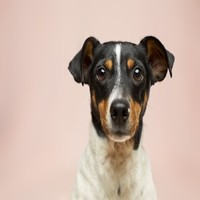</td>
<td><b>80.2%</b></td>
</tr>
<tr>
<td>Person 17</td>
<td></td>
<td><b>Bouvier des Flandres</b></td>
<td></td>
<td><b>73.5%</b></td>
</tr>
<tr>
<td>Person 10</td>
<td></td>
<td><b>Weimaraner</b></td>
<td></td>
<td>65.4%</td>
</tr>
<tr>
<td>Person 07</td>
<td></td>
<td><b>Bouvier des Flandres</b></td>
<td></td>
<td>59.0%</td>
</tr>
<tr>
<td>Person 04</td>
<td></td>
<td><b>Weimaraner</b></td>
<td></td>
<td>57.9%</td>
</tr>
<tr>
<td>Person 08</td>
<td></td>
<td><b>Miniature Pinscher</b></td>
<td></td>
<td>52.4%</td>
</tr>
<tr>
<td>Person 03</td>
<td></td>
<td><b>Miniature Pinscher</b></td>
<td></td>
<td>50.1%</td>
</tr>
<tr>
<td>Person 18</td>
<td></td>
<td><b>Afghan Hound</b></td>
<td></td>
<td>37.1%</td>
</tr>
<tr>
<td>Person 02</td>
<td></td>
<td><b>Saluki</b></td>
<td></td>
<td>39.0%</td>
</tr>
</table>

### Full Results Table

| Person | Predicted Breed | Confidence |
|:------:|:--------------:|:----------:|
| Person 01 | Bouvier des Flandres | 43.3% |
| Person 02 | Saluki | 39.0% |
| Person 03 | Miniature Pinscher | 50.1% |
| Person 04 | Weimaraner | 57.9% |
| Person 05 | Weimaraner | 47.9% |
| Person 06 | Weimaraner | 41.0% |
| Person 07 | Bouvier des Flandres | 59.0% |
| Person 08 | Miniature Pinscher | 52.4% |
| **Person 09** | **Bouvier des Flandres** | **99.4%!!** |
| Person 10 | Weimaraner | 65.4% |
| Person 11 | English Foxhound | 35.5% |
| Person 12 | Weimaraner | 80.2% |
| Person 13 | Weimaraner | 30.0% |
| Person 14 | Weimaraner | 42.9% |
| Person 15 | Bouvier des Flandres | 32.6% |
| Person 16 | English Foxhound | 29.7% |
| Person 17 | Bouvier des Flandres | 73.5% |
| Person 18 | Afghan Hound | 37.1% |
| Person 19 | Weimaraner | 40.3% |
| Person 20 | Weimaraner | 44.9% |

### Most Interesting Matches

```mermaid
flowchart TD
    subgraph Match1["Person 09 → Bouvier des Flandres (99.4%!!)"]
        M1A["The model is 99.4% confident!<br/>Bouvier has a dense, rough coat<br/>and strong facial features — a<br/>remarkable match to this person's<br/>hair texture and face shape"]
    end

    subgraph Match2["Person 12 → Weimaraner (80.2%)"]
        M2A["Weimaraner: sleek, elegant,<br/>short-haired — the model sees<br/>smooth skin and clean features"]
    end

    subgraph Match3["Person 18 → Afghan Hound (37.1%)"]
        M3A["Afghan Hound: long flowing hair,<br/>elegant posture — this person<br/>likely has long hair"]
    end

    style Match1 fill:#fff3e0
    style Match2 fill:#e3f2fd
    style Match3 fill:#fce4ec
```

### What the CNN "Sees" in Human Faces

```mermaid
pie title Most Common "Human" Breeds (Full Model)
    "Weimaraner" : 9
    "Bouvier des Flandres" : 5
    "Miniature Pinscher" : 2
    "English Foxhound" : 2
    "Saluki" : 1
    "Afghan Hound" : 1
```

With the fully-trained model, confidence is MUCH higher (30-99%) compared to the preliminary model (3-20%):

- **Most faces → Weimaraner (9/20):** Smooth skin, clean features, elegant proportions map to this sleek breed
- **Textured hair → Bouvier des Flandres:** People with fuller/curlier hair get matched to this rough-coated breed
- **Long hair → Afghan Hound / Saluki:** Flowing hair maps to these long-haired elegant breeds
- **Person 09 at 99.4%!!** — the strongest human-dog match. The model is almost certain this person "is" a Bouvier des Flandres

---

## 💡 Insights & Conclusions

### Key Takeaways

```mermaid
flowchart TD
    I1["1️⃣ Transfer learning is essential<br/>4.8% → 86.3% (18× better!)"] --> C["🎓 Deep Learning<br/>Lessons"]
    I2["2️⃣ Architecture > Size<br/>Inception 25M > VGG 138M"] --> C
    I3["3️⃣ Parallel paths win<br/>Inception's multi-scale features dominate"] --> C
    I4["4️⃣ CNNs learn features, not concepts<br/>Horse = Saluki (body shape)"] --> C
    I5["5️⃣ Stage 3 (full fine-tune) is best<br/>for full datasets"] --> C

    style C fill:#e8f5e9
    style I1 fill:#e3f2fd
    style I2 fill:#fff3e0
    style I3 fill:#fce4ec
    style I4 fill:#f3e5f5
    style I5 fill:#e0f2f1
```

### Architecture Recommendation Guide

```mermaid
flowchart TD
    Q["What do you need?"] --> A["Best accuracy?"]
    Q --> B["Mobile/edge device?"]
    Q --> C["Learning CNNs?"]
    Q --> D["Research baseline?"]

    A --> A1["✅ Inception<br/>86.3%, multi-scale features"]
    B --> B1["✅ MobileNet<br/>3.4M params, fast"]
    C --> C1["✅ Simple CNN<br/>Build from scratch"]
    D --> D1["✅ VGG-16<br/>Simple, well-understood"]

    style A1 fill:#c8e6c9
    style B1 fill:#c8e6c9
    style C1 fill:#c8e6c9
    style D1 fill:#c8e6c9
```

### What Surprised Us

- **Horse → Whippet at 60.4%** — body shape dominates over fur texture
- **Lion → Chow Chow at 55.1%** — the mane maps to the Chow's fluffy fur
- **Fox → Dhole at 34.1%** — the CNN found the actual wild canine relative
- **Wolf → Eskimo Dog** — thick fur and snowy habitat link wolves to cold-weather breeds
- **Person 09 → Bouvier des Flandres at 99.4%** — strongest human-dog match
- **MobileNet (2.4M) beats VGG-16 (138M)** — 58× fewer params, higher accuracy
- **ResNet-50 achieves 97.9% Top-5** — almost always has the right answer in its top 5

---

## 🚀 How to Run This Project

```mermaid
flowchart TD
    A{Choose Environment} --> B["☁️ Google Colab<br/>(recommended)"]
    A --> C["🐧 WSL/Linux<br/>(local CPU)"]
    A --> D["🪟 Windows<br/>(PowerShell)"]

    B --> B1["Upload notebook<br/>A100 GPU<br/>Run All<br/>~1-2 hours"]
    C --> C1["uv venv<br/>pip install<br/>python run_training.py<br/>~3-4 hours (CPU)"]
    D --> D1["uv venv<br/>.venv\\Scripts\\activate<br/>python run_training.py"]

    style B fill:#c8e6c9
    style B1 fill:#e8f5e9
```

### Option A: Google Colab (Recommended)

1. Upload `notebooks/dog_breed_classifier.ipynb` to Colab
2. Runtime → Change runtime type → **A100 GPU**
3. Run all 15 cells in order

### Option B: WSL / Local

```bash
cd /mnt/c/2025AIDEV/L41
uv venv && source .venv/bin/activate
uv pip install -r requirements.txt
python run_training.py
```

---

## 📁 Project Structure

```mermaid
flowchart TD
    subgraph SRC["src/"]
        direction TB
        CFG["config.py<br/>Settings & paths"]
        DATA["data/<br/>Download, organize<br/>augment, load"]
        MODELS["models/<br/>6 CNN architectures"]
        TRAIN["training/<br/>Train loop, TL,<br/>evaluation"]
        INF["inference/<br/>predict_dog_breed()"]
        EXP["experiments/<br/>Animals & celebrities"]
        VIZ["visualization/<br/>Plots & galleries"]
    end

    subgraph OUT["results/"]
        GRAPHS["graphs/<br/>5 PNG charts"]
        TABLES["tables/<br/>CSV results"]
        WEIGHTS["models/<br/>.pth weights"]
    end

    subgraph DOCS["docs/"]
        PRD["PRD.md"]
        TASKS["tasks.json<br/>68 tasks"]
    end

    NB["notebooks/<br/>Colab notebook<br/>15 cells"]
    README["README.md<br/>This file!"]

    style SRC fill:#e3f2fd
    style OUT fill:#e8f5e9
    style DOCS fill:#fff3e0
```

---

## 📚 References

- **AlexNet:** Krizhevsky et al., "ImageNet Classification with Deep CNNs" (2012)
- **VGG:** Simonyan & Zisserman, "Very Deep Convolutional Networks" (2014)
- **GoogLeNet:** Szegedy et al., "Going Deeper with Convolutions" (2014)
- **ResNet:** He et al., "Deep Residual Learning for Image Recognition" (2015)
- **MobileNet:** Sandler et al., "MobileNetV2: Inverted Residuals" (2018)
- **Dataset:** [Kaggle Dog Breed Identification](https://www.kaggle.com/c/dog-breed-identification)

---

*Final results from Colab A100 GPU training on full dataset (8,127 images, 120 breeds).*

*Built with PyTorch | Trained on 120 dog breeds | 6 architectures compared*
