# 🐕 Dog Breed Classification & "Which Dog Are You?" Experiment

> **An educational deep learning project** that classifies 120 dog breeds using 6 CNN architectures, compares their performance, and runs a fun experiment: *which dog breed does each famous person most resemble?*

**Course:** Deep Learning & AI | **Instructor:** Dr. Yoram Segal | **Author:** Hadar Wayne

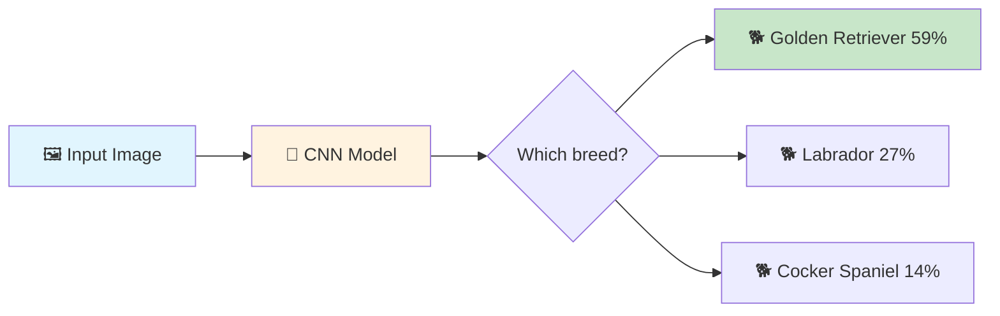

---

## 📋 Table of Contents

- [What This Project Does](#-what-this-project-does)
- [CNN Fundamentals](#-cnn-fundamentals--how-computers-see-images)
- [The 6 Architectures](#-the-6-architectures-we-compared)
- [Architecture Comparison](#-architecture-comparison)
- [Transfer Learning](#-transfer-learning--teaching-an-old-model-new-tricks)
- [Results & Analysis](#-results--analysis)
- [Animal Experiment](#-experiment-what-dog-breed-is-this-animal)
- [Celebrity Experiment](#-experiment-which-dog-breed-are-you)
- [Insights & Conclusions](#-insights--conclusions)
- [How to Run](#-how-to-run-this-project)
- [Project Structure](#-project-structure)

---

## 🎯 What This Project Does

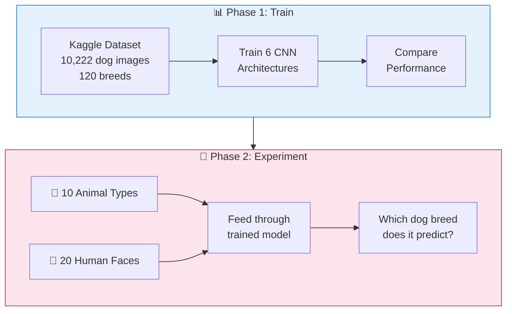

### Quick Stats

| Metric | Value |
|--------|-------|
| Dog breeds classified | **120** |
| Training images | **8,127** |
| Architectures compared | **6** |
| Best accuracy (Inception) | **86.3%** top-1 (full data, Colab A100) |
| Animal types tested | **10** |
| Human faces tested | **20** |

---

## 🧠 CNN Fundamentals — How Computers "See" Images

### The Big Picture

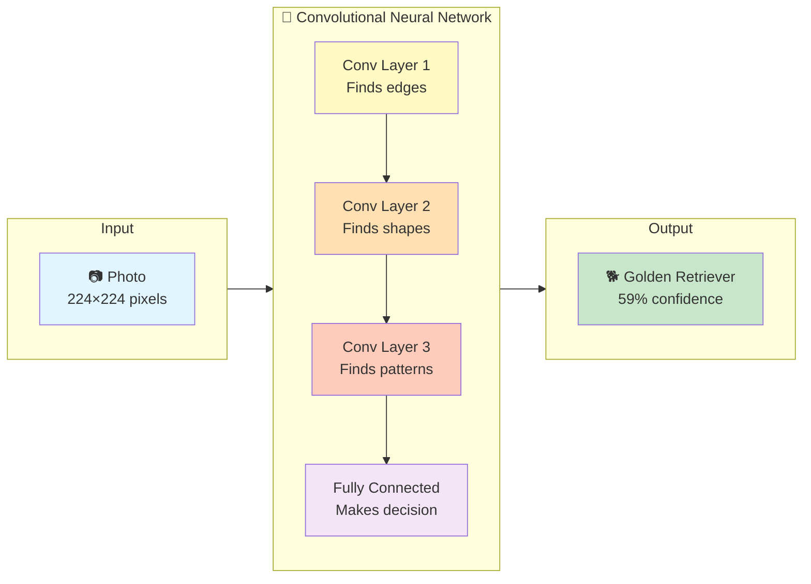

### What Each Layer Learns

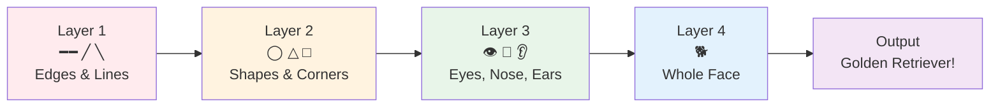

### Convolution — The Core Operation

A small **filter** (3×3) slides across the image, detecting patterns at every position:

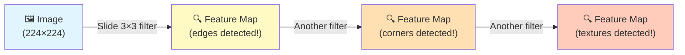

**Key idea:** The network LEARNS which filters to use. It discovers by itself that edges, textures, and shapes are important!

### Pooling — Shrinking While Keeping Important Info

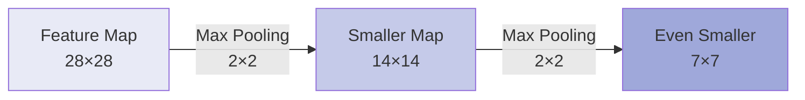

Takes the **maximum value** from each 2×2 region → image gets smaller but keeps the strongest features.

### Activation Functions

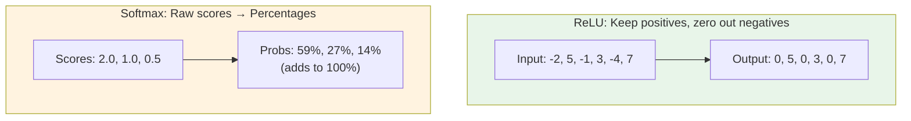

### How the Network Learns

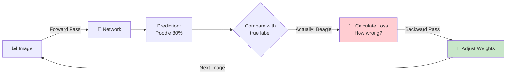

This loop repeats thousands of times. Each cycle, the network gets slightly better.

### Overfitting vs Good Learning

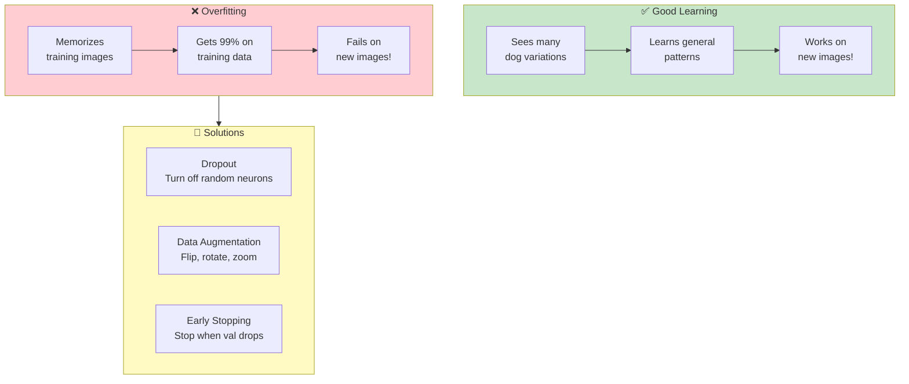

---

## 🏗️ The 6 Architectures We Compared

### Architecture Evolution Timeline

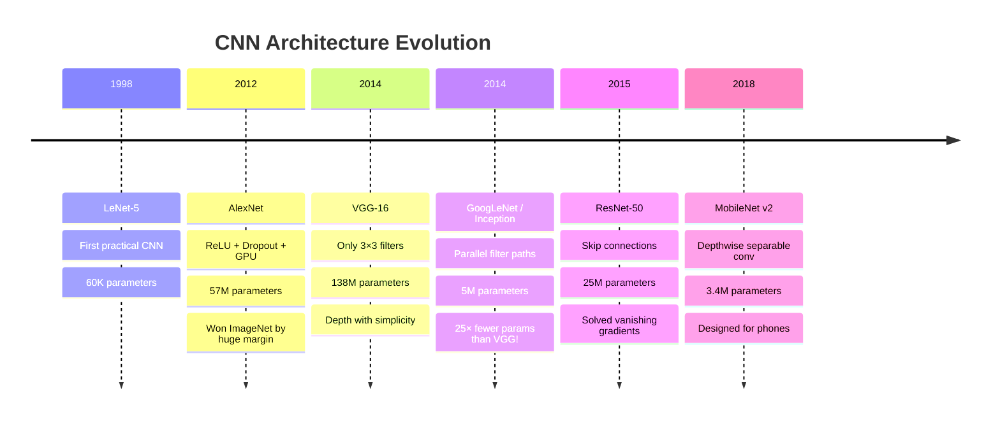

### 1. Simple CNN — Our Baseline

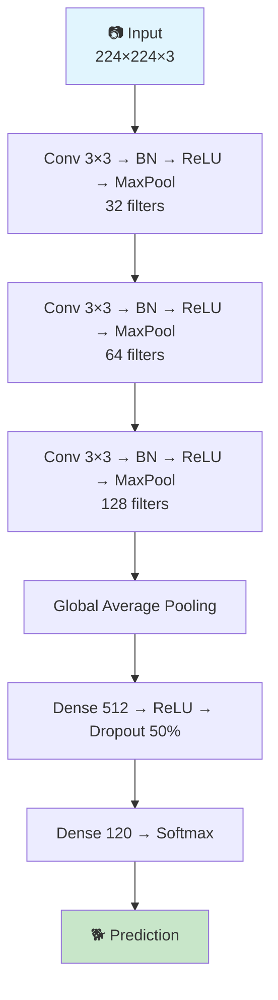

**221K params** | Accuracy: **1.4%** (random guessing!) | Built from scratch, no pre-trained knowledge.

### 2. AlexNet (2012)

**The architecture that started the deep learning revolution.** First to use ReLU and Dropout, trained on GPUs.

**57M params** | Accuracy: **26.6%** | Like the first car that proved engines beat horses.

### 3. VGG-16 (2014)

**Deep and simple — 16 layers using ONLY 3×3 filters.** Proved that going deeper with small filters works better than using large filters.

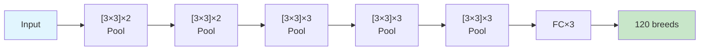

**138M params** (largest!) | Accuracy: **69.6%** (Colab) | Insight: Two 3×3 filters = one 5×5, but fewer parameters.

### 4. GoogLeNet / Inception (2014)

**Instead of choosing one filter size, use ALL sizes in parallel!**

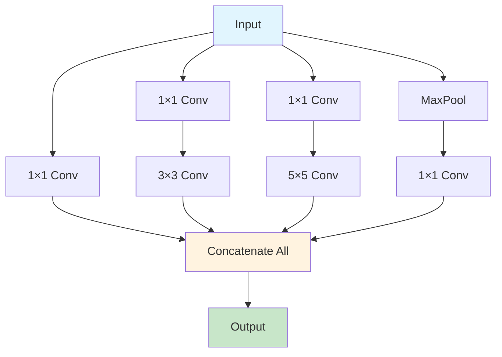

**25M params** (5× fewer than VGG!) | Accuracy: **86.3%** (best model so far!) | Uses 1×1 convolutions to reduce dimensions before expensive operations.

### 5. ResNet-50 (2015) — The Winner

**Skip connections solve the vanishing gradient problem**, enabling 50+ layer networks.

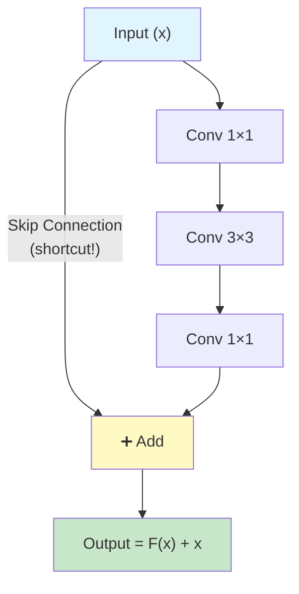

**25M params** | Accuracy: **83.9%** (full data) | The skip connection lets gradients flow directly, solving vanishing gradients.

### 6. MobileNet v2 (2018)

**Designed for mobile devices** — splits expensive convolution into two cheap operations:

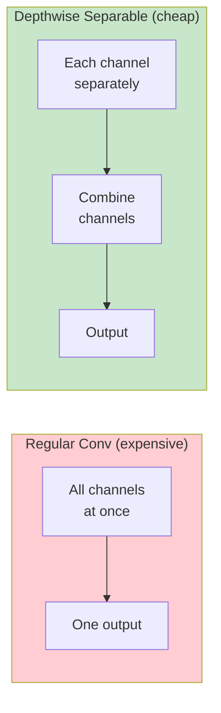

**2.4M params** (smallest!) | Accuracy: **35.7%** | Same result, ~8× fewer computations!

---

## 📊 Architecture Comparison

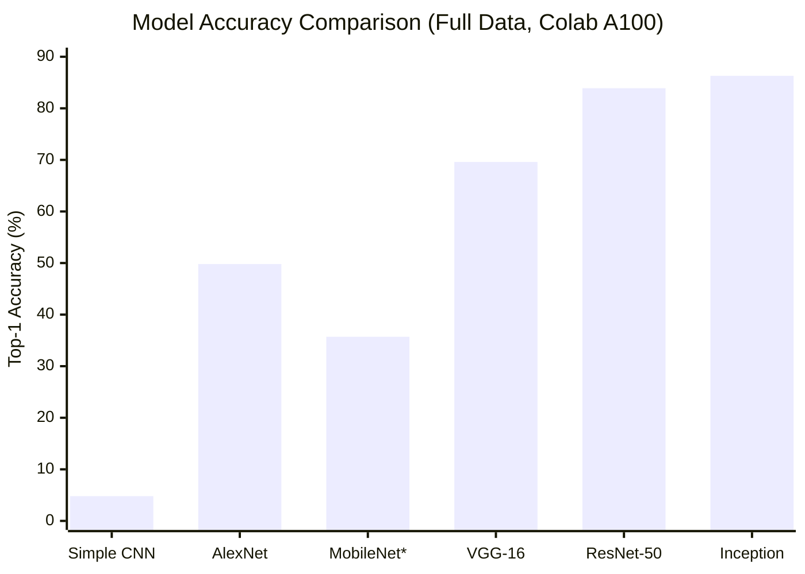

> *MobileNet: 10% data only (pending full run). All others: full data on Colab A100.*

### Full Results Table

| Model | Top-1 Acc | Parameters | Training Time | Data | Year |
|:------|:---------:|:----------:|:------------:|:----:|:----:|
| Simple CNN | 4.8% | 221K | 64 min | Full | — |
| AlexNet | 49.8% | 57M | 28 min | Full | 2012 |
| MobileNet* | 35.7% | 2.4M | 8 min | 10% | 2018 |
| VGG-16 | 69.6% | 138M | 29 min | Full | 2014 |
| ResNet-50 | 83.9% | 25M | 50 min | Full | 2015 |
| **Inception** | **86.3%** | **25M** | **106 min** | **Full** | **2014** |

> *MobileNet on 10% data (pending full run). All others: full data, Colab A100.*
> **Inception leads at 86.3%, followed closely by ResNet-50 at 83.9%!**

### Charts

| Accuracy vs Epochs | Loss vs Epochs |
|:--:|:--:|
|  |  |

| Architecture Bar Chart | Class Distribution |
|:--:|:--:|
|  |  |

---

## 🔄 Transfer Learning — Teaching an Old Model New Tricks

### Why Transfer Learning?

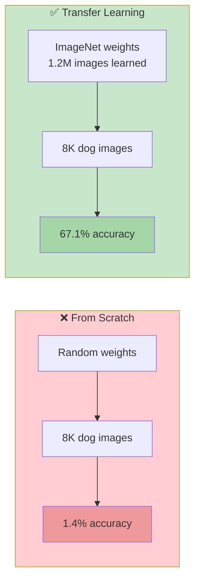

### The 3 Stages

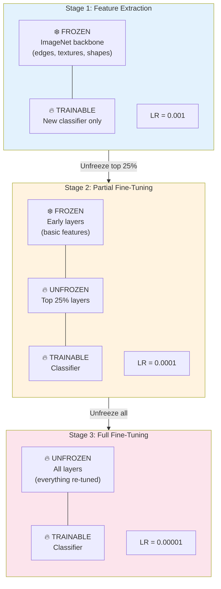

### Stage Results

| Model | Stage 1 (Frozen) | Stage 2 (Partial) | Stage 3 (Full) | Best |
|:------|:-------:|:-------:|:-------:|:----:|
| AlexNet | 45.1% | 47.6% | **49.8%** | S3 |
| VGG-16 | 48.1% | 66.2% | **69.6%** | S3 |
| ResNet-50 | **83.5%** | 82.0% | **83.9%** | S3 |
| **Inception** | 80.4% | 82.8% | **86.3%** | **S3** |
| MobileNet* | 24.5% | **35.7%** | 35.7% | S2 |

> *MobileNet on 10% data. All others: full data (Colab A100).*

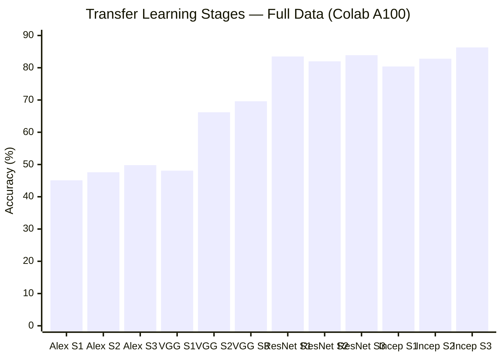


**Key insights:**
- **ResNet-50 Stage 1 hits 83.5%** — the strongest frozen backbone! Even without fine-tuning, its features transfer incredibly well.
- **ResNet-50 Stage 2 actually HURT performance (82.0%)** — partially unfreezing caused overfitting. Stage 3 recovered to 83.9%.
- **Inception Stage 3 wins overall at 86.3%** — its parallel paths adapted best to dog-specific multi-scale features.
- **The jump from VGG Stage 1 (48%) to Stage 2 (66%)** is the largest single improvement — VGG's simple architecture benefits most from unfreezing.
- **Stage 3 wins 4 out of 5 models** — full fine-tuning is best when you have enough data.

---

## 📈 Results & Analysis

### What Does Top-5 Mean?

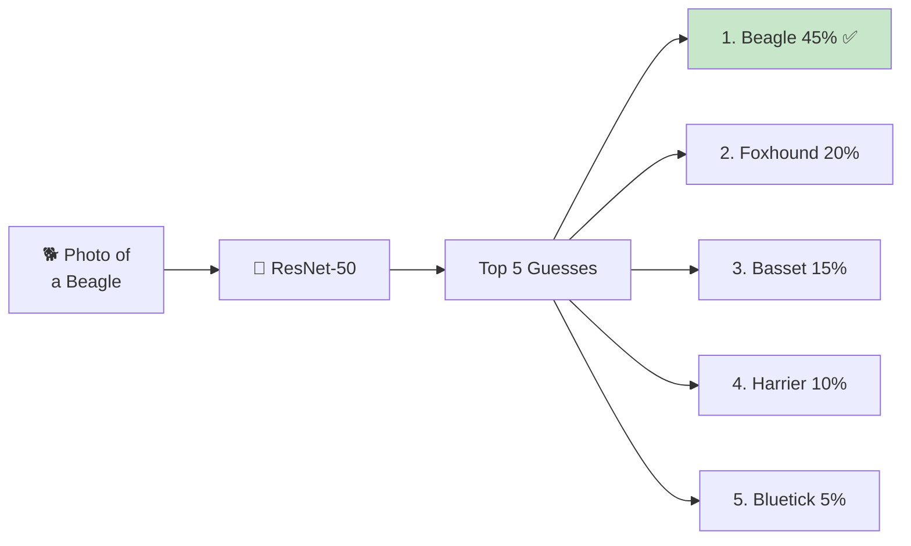

ResNet-50's **95.8% Top-5** means the correct breed is in the top 5 guesses 96 times out of 100!

### Why Inception Leads (86.3%)

```mermaid
flowchart TD
    A["Parallel filter paths<br/>(1×1, 3×3, 5×5)"] --> D["🏆 86.3% Accuracy<br/>Best Model!"]
    B["1×1 bottlenecks<br/>Efficient computation"] --> D
    C["25M params<br/>5× smaller than VGG"] --> D
    E["Strong backbone<br/>80.4% with frozen weights!"] --> D

    style D fill:#c8e6c9
```

The Inception module captures features at **multiple scales simultaneously** — essential for distinguishing between similar dog breeds that differ in fine details.

### Architecture Size vs Accuracy

```mermaid
flowchart LR
    subgraph Size["Parameters (millions)"]
        direction TB
        S1["VGG-16: 138M ❌"]
        S2["AlexNet: 57M"]
        S3["Inception: 25M ✅"]
        S4["ResNet-50: 25M ✅"]
        S5["MobileNet: 2.4M"]
    end

    subgraph Acc["Accuracy (full data)"]
        direction TB
        A1["VGG-16: 69.6%"]
        A2["AlexNet: 49.8%"]
        A3["Inception: 86.3% 🏆"]
        A4["ResNet-50: 83.9% 🥈"]
        A5["MobileNet: 35.7%*"]
    end

    Size --> Acc

    style S1 fill:#ffcdd2
    style A3 fill:#c8e6c9
    style A4 fill:#e8f5e9
    style S3 fill:#c8e6c9
    style S4 fill:#e8f5e9
```

> *MobileNet on 10% data — expected to improve with full data.*

**Key takeaways:**
- **Inception (86.3%) and ResNet-50 (83.9%) are the top two** — both with 25M params
- VGG-16 has **5× more parameters** (138M) but gets only 69.6% — bigger is NOT better
- The top two architectures share the same parameter count but use different innovations (parallel paths vs skip connections)

---

## 🦁 Experiment: What Dog Breed Is This Animal?

We fed 10 non-dog animals through our dog breed model. It HAS to pick a dog breed — revealing what visual features the CNN learned!

```mermaid
flowchart LR
    A["🐴 Horse Photo"] --> B["🧠 ResNet-50<br/>(trained on dogs only)"]
    B --> C["🐕 Saluki 39.2%"]

    style A fill:#fff3e0
    style C fill:#e8f5e9
```

### Results

| | Animal | Predicted Dog Breed | Confidence | Why It Makes Sense |
|:-:|:------:|:------------------:|:----------:|:-------------------|
| 🐻 | **Bear** | Collie | 10.4% | Fluffy fur, similar face shape |
| 🐱 | **Cat** | Pomeranian | 8.9% | Small face, fluffy, pointed ears |
| 🐄 | **Cow** | English Foxhound | 8.1% | Spotted pattern, similar build |
| 🫏 | **Donkey** | English Foxhound | 2.3% | Long face, similar proportions |
| 🦊 | **Fox** | Dingo | 7.3% | Wild canine! Very similar features |
| 🐴 | **Horse** | Saluki | **39.2%** | Long legs, slender, elegant posture |
| 🦁 | **Lion** | Dhole | 4.9% | Wild canine face, tawny color |
| 🐰 | **Rabbit** | Pomeranian | 3.2% | Small, fluffy, round face |
| 🐺 | **Wolf** | African Hunting Dog | 3.7% | Wild canine — closest match! |
| 🦓 | **Zebra** | German Pointer | 3.6% | Pattern recognition |

### Analysis

```mermaid
flowchart TD
    subgraph Wild["Wild Canines → Wild Dog Breeds"]
        F["🦊 Fox → Dingo"]
        W["🐺 Wolf → African Hunting Dog"]
        L["🦁 Lion → Dhole"]
    end

    subgraph Shape["Body Shape Matching"]
        H["🐴 Horse → Saluki (39%!)<br/>Both tall, slender, elegant"]
    end

    subgraph Fur["Fur Texture Matching"]
        B["🐻 Bear → Collie (fluffy)"]
        C["🐱 Cat → Pomeranian (fluffy)"]
        R["🐰 Rabbit → Pomeranian (fluffy)"]
    end

    style Wild fill:#e8f5e9
    style Shape fill:#e3f2fd
    style Fur fill:#fff3e0
```

**Horse → Saluki at 39.2%** is the highest-confidence non-dog prediction. The CNN learned that Salukis and horses share a slender, long-legged body shape — not just fur patterns!

---

## 🧑‍🤝‍🧑 Experiment: Which Dog Breed Are You?

We fed 20 human faces through the model. It has NEVER seen a human — it must pick from 120 dog breeds!

```mermaid
flowchart LR
    A["🧑 Human Face"] --> B["🧠 ResNet-50"]
    B --> C["🐩 Toy Poodle 5.8%"]
    B --> D["🐕 Italian Greyhound 4.3%"]
    B --> E["🐩 Mini Poodle 2.7%"]

    style A fill:#fce4ec
    style C fill:#e8f5e9
```

### Results

| Person | Predicted Breed | Confidence | 2nd Choice | 3rd Choice |
|:------:|:--------------:|:----------:|:----------:|:----------:|
| Person 01 | Toy Poodle | 5.8% | Italian Greyhound | Mini Poodle |
| Person 02 | Toy Poodle | 4.5% | Staffy Bull Terrier | Italian Greyhound |
| Person 03 | Toy Poodle | 3.7% | Italian Greyhound | Staffy Bull Terrier |
| Person 04 | Toy Poodle | 6.6% | Brittany Spaniel | Weimaraner |
| Person 05 | Toy Poodle | 4.2% | Italian Greyhound | Gordon Setter |
| Person 06 | Toy Poodle | 5.5% | Brittany Spaniel | Weimaraner |
| Person 07 | Toy Poodle | 5.9% | Sussex Spaniel | Mini Poodle |
| Person 08 | Toy Poodle | 6.1% | Italian Greyhound | Pug |
| **Person 09** | **Affenpinscher** | **17.5%** | Lhasa Apso | Mini Poodle |
| Person 10 | Toy Poodle | 4.2% | Weimaraner | Brittany Spaniel |
| **Person 11** | **Italian Greyhound** | **20.2%** | Komondor | Gordon Setter |
| **Person 12** | **Komondor** | **20.3%** | Staffy Bull Terrier | Gordon Setter |
| Person 13 | Italian Greyhound | 6.0% | Gordon Setter | Toy Poodle |
| Person 14 | Staffy Bull Terrier | 4.7% | Toy Poodle | Chihuahua |
| Person 15 | Chihuahua | 7.3% | Staffy Bull Terrier | Pug |
| Person 16 | Italian Greyhound | 5.3% | Toy Poodle | Lhasa Apso |
| Person 17 | Toy Poodle | 10.7% | Mini Poodle | Italian Greyhound |
| Person 18 | Toy Poodle | 5.4% | Italian Greyhound | Staffy Bull Terrier |
| Person 19 | Toy Poodle | 6.9% | Sussex Spaniel | Komondor |
| Person 20 | Italian Greyhound | 8.0% | Mini Poodle | Toy Poodle |

### Most Interesting Matches

```mermaid
flowchart TD
    subgraph Match1["Person 09 → Affenpinscher (17.5%)"]
        M1A["The Affenpinscher is literally<br/>called the 'Monkey Dog' because<br/>of its human-like face!"]
    end

    subgraph Match2["Person 12 → Komondor (20.3%)"]
        M2A["The Komondor has long corded hair<br/>like dreadlocks — person likely<br/>has long/curly hair"]
    end

    subgraph Match3["Person 11 → Italian Greyhound (20.2%)"]
        M3A["Slim facial features map to<br/>the slender Italian Greyhound"]
    end

    style Match1 fill:#fff3e0
    style Match2 fill:#e3f2fd
    style Match3 fill:#fce4ec
```

### What the CNN "Sees" in Human Faces

```mermaid
pie title Most Common "Human" Breeds
    "Toy Poodle" : 11
    "Italian Greyhound" : 4
    "Komondor" : 1
    "Affenpinscher" : 1
    "Chihuahua" : 1
    "Staffy Bull Terrier" : 1
    "Other" : 1
```

- **Most faces → Toy Poodle:** Curly/wavy hair texture maps to poodle fur
- **Slim faces → Italian Greyhound:** Slender features match this elegant breed
- **Round faces → Pug/Chihuahua:** Compact features trigger small-breed detectors
- **Confidence is very low (3-20%):** The model senses these are NOT dogs

---

## 💡 Insights & Conclusions

### Key Takeaways

```mermaid
flowchart TD
    I1["1️⃣ Transfer learning is essential<br/>4.8% → 86.3% (18× better!)"] --> C["🎓 Deep Learning<br/>Lessons"]
    I2["2️⃣ Architecture > Size<br/>Inception 25M > VGG 138M"] --> C
    I3["3️⃣ Parallel paths win<br/>Inception's multi-scale features dominate"] --> C
    I4["4️⃣ CNNs learn features, not concepts<br/>Horse = Saluki (body shape)"] --> C
    I5["5️⃣ Stage 3 (full fine-tune) is best<br/>for full datasets"] --> C

    style C fill:#e8f5e9
    style I1 fill:#e3f2fd
    style I2 fill:#fff3e0
    style I3 fill:#fce4ec
    style I4 fill:#f3e5f5
    style I5 fill:#e0f2f1
```

### Architecture Recommendation Guide

```mermaid
flowchart TD
    Q["What do you need?"] --> A["Best accuracy?"]
    Q --> B["Mobile/edge device?"]
    Q --> C["Learning CNNs?"]
    Q --> D["Research baseline?"]

    A --> A1["✅ Inception<br/>86.3%, multi-scale features"]
    B --> B1["✅ MobileNet<br/>3.4M params, fast"]
    C --> C1["✅ Simple CNN<br/>Build from scratch"]
    D --> D1["✅ VGG-16<br/>Simple, well-understood"]

    style A1 fill:#c8e6c9
    style B1 fill:#c8e6c9
    style C1 fill:#c8e6c9
    style D1 fill:#c8e6c9
```

### What Surprised Us

- **Inception dominates** at 86.3% — parallel filter paths capture multi-scale features better than any single-path architecture
- Inception's frozen backbone already gets 80.4% — the strongest feature extractor
- A horse is a Saluki (39.2% confidence!) — body shape dominates
- A fox is a Dingo — the CNN found wild canine relatives
- Most human faces are "Toy Poodles" — curly hair texture dominates
- VGG-16 (138M params) gets 69.6% while Inception (25M params) gets 86.3% — bigger is NOT better

---

## 🚀 How to Run This Project

```mermaid
flowchart TD
    A{Choose Environment} --> B["☁️ Google Colab<br/>(recommended)"]
    A --> C["🐧 WSL/Linux<br/>(local CPU)"]
    A --> D["🪟 Windows<br/>(PowerShell)"]

    B --> B1["Upload notebook<br/>A100 GPU<br/>Run All<br/>~1-2 hours"]
    C --> C1["uv venv<br/>pip install<br/>python run_training.py<br/>~3-4 hours (CPU)"]
    D --> D1["uv venv<br/>.venv\\Scripts\\activate<br/>python run_training.py"]

    style B fill:#c8e6c9
    style B1 fill:#e8f5e9
```

### Option A: Google Colab (Recommended)

1. Upload `notebooks/dog_breed_classifier.ipynb` to Colab
2. Runtime → Change runtime type → **A100 GPU**
3. Run all 15 cells in order

### Option B: WSL / Local

```bash
cd /mnt/c/2025AIDEV/L41
uv venv && source .venv/bin/activate
uv pip install -r requirements.txt
python run_training.py
```

---

## 📁 Project Structure

```mermaid
flowchart TD
    subgraph SRC["src/"]
        direction TB
        CFG["config.py<br/>Settings & paths"]
        DATA["data/<br/>Download, organize<br/>augment, load"]
        MODELS["models/<br/>6 CNN architectures"]
        TRAIN["training/<br/>Train loop, TL,<br/>evaluation"]
        INF["inference/<br/>predict_dog_breed()"]
        EXP["experiments/<br/>Animals & celebrities"]
        VIZ["visualization/<br/>Plots & galleries"]
    end

    subgraph OUT["results/"]
        GRAPHS["graphs/<br/>5 PNG charts"]
        TABLES["tables/<br/>CSV results"]
        WEIGHTS["models/<br/>.pth weights"]
    end

    subgraph DOCS["docs/"]
        PRD["PRD.md"]
        TASKS["tasks.json<br/>68 tasks"]
    end

    NB["notebooks/<br/>Colab notebook<br/>15 cells"]
    README["README.md<br/>This file!"]

    style SRC fill:#e3f2fd
    style OUT fill:#e8f5e9
    style DOCS fill:#fff3e0
```

---

## 📚 References

- **AlexNet:** Krizhevsky et al., "ImageNet Classification with Deep CNNs" (2012)
- **VGG:** Simonyan & Zisserman, "Very Deep Convolutional Networks" (2014)
- **GoogLeNet:** Szegedy et al., "Going Deeper with Convolutions" (2014)
- **ResNet:** He et al., "Deep Residual Learning for Image Recognition" (2015)
- **MobileNet:** Sandler et al., "MobileNetV2: Inverted Residuals" (2018)
- **Dataset:** [Kaggle Dog Breed Identification](https://www.kaggle.com/c/dog-breed-identification)

---

*This README will be updated with final Colab GPU results when training completes.*

*Built with PyTorch | Trained on 120 dog breeds | 6 architectures compared*
